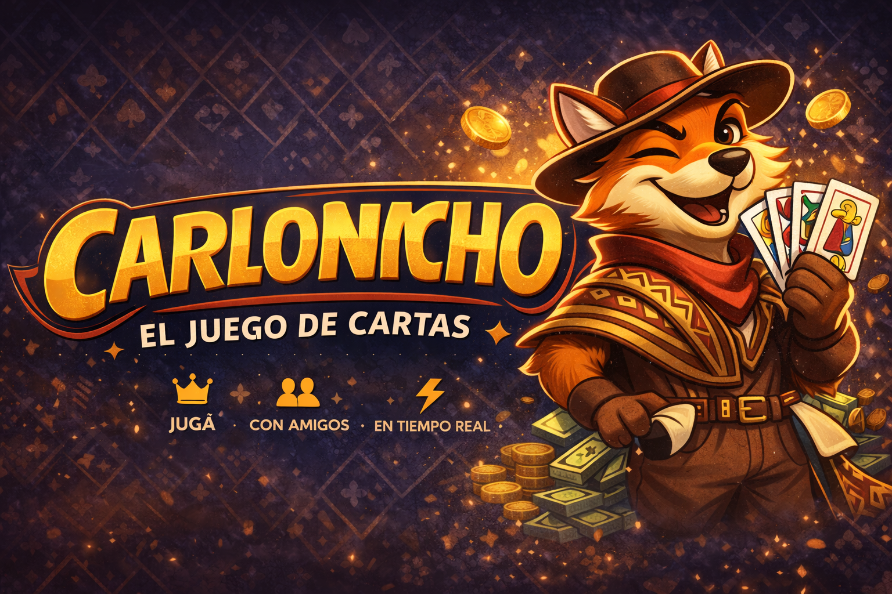

# 🃏 Carloncho

<div align="center">



[](https://reactnative.dev/)
[](https://expo.dev/)
[](https://www.typescriptlang.org/)
[](https://supabase.com/)

**A real-time multiplayer card game for iOS and Android inspired by the classic Rioplatense card game.**

</div>

---


### 📱 Demo

> Screenshots and GIF coming soon

---

### 🎮 How to Play

"Carloncho" is a betting card game played with a **Spanish deck (48 cards, 1–12, four suits: espada, basto, copa, oro)**.

1. Players agree on an **initial bet** — each player contributes the same amount to the **pot**
2. Each turn, a player receives **2 face-down cards**
3. The player can:
   - **Pass** — return the cards without betting
   - **Bet** — choose an amount (up to the full pot)
4. If they bet, a **3rd card** is revealed:
   - 🟢 Card falls **between** the two → **WIN** that amount from the pot
   - 🔴 Card is **equal** to one of the two → **LOSE double** the bet
   - 🔴 Card falls **outside** the range → **LOSE** the bet
5. The game ends when someone wins the **entire pot** or the deck runs out
6. The player with the **highest net earnings** wins

**Example:**
- Cards: 3 and 9 → you have 5 chances (4, 5, 6, 7, 8) → good odds to bet
- Cards: 5 and 6 → no range possible → pass
- Cards: 1 and 12 → maximum range → bet the pot!

---

### 🛠 Tech Stack

| Layer | Technology |
|---|---|
| Mobile App | React Native + Expo |
| Language | TypeScript |
| Navigation | React Navigation (Native Stack) |
| Backend | Supabase (PostgreSQL) |
| Real-time | Supabase Realtime |
| Server Logic | Supabase Edge Functions (Deno) |
| Auth | Anonymous (room code) |
| Animations | React Native Reanimated |
| Audio | expo-av |

---

### 🏗 Architecture

```
┌─────────────────────────────────────┐
│           Mobile Client             │
│   React Native + Expo (iOS/Android) │
│                                     │
│  HomeScreen → LobbyScreen           │
│  GameScreen → ResultScreen          │
│  EndScreen                          │
└──────────────┬──────────────────────┘
               │ HTTPS + Realtime WS
┌──────────────▼──────────────────────┐
│            Supabase                 │
│                                     │
│  ┌─────────────┐  ┌──────────────┐  │
│  │  PostgreSQL │  │ Edge Functions│  │
│  │             │  │              │  │
│  │  salas      │  │ crear-sala   │  │
│  │  jugadores  │  │ unirse-sala  │  │
│  │  turnos     │  │ iniciar-     │  │
│  │             │  │   partida    │  │
│  └─────────────┘  │ repartir-    │  │
│                   │   cartas     │  │
│  ┌─────────────┐  │ resolver-    │  │
│  │  Realtime   │  │   turno      │  │
│  │  (live sync)│  │ nueva-ronda  │  │
│  └─────────────┘  └──────────────┘  │
└─────────────────────────────────────┘
```

**Key principle:** All game logic is validated server-side in Edge Functions. The client only renders state and sends actions — it can never cheat.

---

### 🚀 Getting Started

#### Prerequisites

- [Node.js](https://nodejs.org/) (LTS version)
- [Expo Go](https://expo.dev/client) app on your phone
- [Supabase](https://supabase.com/) account (free tier works)
- [Supabase CLI](https://supabase.com/docs/guides/cli)

#### Installation

**1. Clone the repository**
```bash
git clone https://github.com/your-username/carloncho.git
cd carloncho
```

**2. Install dependencies**
```bash
npm install
```

**3. Set up environment variables**
```bash
cp .env.example .env
```
Fill in your Supabase credentials in `.env` (see [Environment Variables](#environment-variables))

**4. Set up the database**

Go to your Supabase project → SQL Editor and run:
```sql
-- Rooms
CREATE TABLE salas (
  id UUID DEFAULT gen_random_uuid() PRIMARY KEY,
  codigo TEXT UNIQUE NOT NULL,
  estado TEXT DEFAULT 'esperando',
  pozo INTEGER DEFAULT 0,
  apuesta_inicial INTEGER NOT NULL,
  turno_actual INTEGER DEFAULT 0,
  host_id UUID,
  creado_en TIMESTAMP DEFAULT NOW()
);

-- Players
CREATE TABLE jugadores (
  id UUID DEFAULT gen_random_uuid() PRIMARY KEY,
  sala_id UUID REFERENCES salas(id) ON DELETE CASCADE,
  nombre TEXT NOT NULL,
  balance INTEGER DEFAULT 0,
  orden INTEGER NOT NULL,
  activo BOOLEAN DEFAULT TRUE,
  ausente BOOLEAN DEFAULT FALSE,
  creado_en TIMESTAMP DEFAULT NOW()
);

-- Turns
CREATE TABLE turnos (
  id UUID DEFAULT gen_random_uuid() PRIMARY KEY,
  sala_id UUID REFERENCES salas(id) ON DELETE CASCADE,
  jugador_id UUID REFERENCES jugadores(id),
  carta1 TEXT,
  carta2 TEXT,
  carta3 TEXT,
  apuesta INTEGER DEFAULT 0,
  resultado TEXT,
  ganancia INTEGER DEFAULT 0,
  creado_en TIMESTAMP DEFAULT NOW()
);

-- Enable Realtime
ALTER PUBLICATION supabase_realtime ADD TABLE salas;
ALTER PUBLICATION supabase_realtime ADD TABLE jugadores;
ALTER PUBLICATION supabase_realtime ADD TABLE turnos;
```

**5. Deploy Edge Functions**
```bash
supabase login
supabase link --project-ref YOUR_PROJECT_REF
supabase functions deploy crear-sala
supabase functions deploy unirse-sala
supabase functions deploy iniciar-partida
supabase functions deploy repartir-cartas
supabase functions deploy resolver-turno
supabase functions deploy nueva-ronda
supabase functions deploy reiniciar-sala
```

**6. Start the development server**
```bash
npx expo start --clear
```

Scan the QR code with your phone's camera (iOS) or Expo Go (Android).

---

### ⚙️ Environment Variables

Create a `.env` file in the root of the project:

```env
EXPO_PUBLIC_SUPABASE_URL=https://your-project.supabase.co
EXPO_PUBLIC_SUPABASE_ANON_KEY=your-anon-key
```

> ⚠️ Never commit your `.env` file. It's already in `.gitignore`.

You can find these values in your Supabase project under **Settings → API**.

---

## Español

### 🎮 Cómo se juega

Carloncho es un juego de apuestas con **baraja española (48 cartas, del 1 al 12, palos: espada, basto, copa y oro. Sota=10, Caballo=11, Rey=12)**.

1. Los jugadores acuerdan una **apuesta inicial** — cada uno aporta al **pozo**
2. En cada turno, el jugador recibe **2 cartas boca abajo**
3. El jugador puede:
   - **Pasar** — devuelve las cartas sin apostar
   - **Apostar** — elige un monto (hasta el pozo completo)
4. Si apuesta, se revela una **3ra carta**:
   - 🟢 La carta cae **entre** las dos → **GANA** ese monto del pozo
   - 🔴 La carta es **igual** a una de las dos → **PIERDE el doble**
   - 🔴 La carta cae **fuera** del rango → **PIERDE** lo apostado
5. El juego termina cuando alguien gana el **pozo entero** o se acaban las cartas

---

### 🚀 Instalación rápida

```bash
git clone https://github.com/your-username/carloncho.git
cd carloncho
npm install
cp .env.example .env
# Completar .env con credenciales de Supabase
npx expo start --clear
```

---

<div align="center">

Made with ❤️ in Uruguay 🇺🇾

</div>
